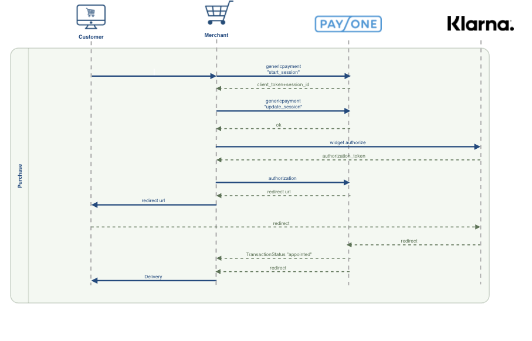

<!-- START doctoc generated TOC please keep comment here to allow auto update -->
<!-- DON'T EDIT THIS SECTION, INSTEAD RE-RUN doctoc TO UPDATE -->
**Table of Contents** 

- [Preparation](#preparation)
- [The Klarna payment process](#the-klarna-payment-process)
  - [Start session request](#start-session-request)
  - [Update Session](#update-session)
  - [Load the klarna widget and authorize the payment](#load-the-klarna-widget-and-authorize-the-payment)
  - [Authorize payment within payone.](#authorize-payment-within-payone)

<!-- END doctoc generated TOC please keep comment here to allow auto update -->

# Preparation

  1. [Create Klarna account](https://klarna.com/buy-klarna/our-services/klarna-account), if not created yet.
     For test purpose - [create test Klarna account](https://developers.klarna.com/en/de/kpm/apply-for-test-account).
  
  2. Activate Klarna mode in Payone. **Note**: this process may take couple of days, so do it beforehand.
     
     2.1 Supply Klarna API credentials (_EID_ and _Shared Secret_) to your Payone Merchant Manager.
  
  3. Create or extend Klarna payment custom type in commercetools platform. In addition to standard _languageCode_ and _reference_
     fields add the following:

  <table>
   <tr>
      <th>Name</th>
      <th>Type</th>
      <th>Required</th>
      <th>Input Hint</th>
      <th>Notes</th>
   </tr>
   <tr>
      <td><b><code>ip</code></b></td>
      <td rowspan="10"><i>String</i></td>
      <td rowspan="4"><b>true</b></td>
      <td rowspan="10"><i>SingleLine</i></td>
      <td></td>
   </tr>
   <tr>
      <td><b><code>gender</code></b></td>
      <td>Only first lowercase character is used, see <a href="/blob/master/service/src/main/java/com/commercetools/pspadapter/payone/mapping/MappingUtil.java#L181-L181">MappingUtil.getGenderFromPaymentCart()</a></td>
   </tr>
   <tr>
      <td><b><code>birthday</code></b></td>
      <td>If this field is empty - the service will try to apply <a href="http://dev.commercetools.com/http-api-projects-customers.html#customer">Customer's dateOfBirth</a>, 
         but this field is an optional, also it is not available for anonymous/guest checkout. 
         <b>Thus we stronghly recommend to set this field.</b>
      </td>
   </tr>
   <tr>
      <td><b><code>telephonenumber</code></b></td>
      <td></td>
   </tr>
   <tr>
      <td><b><code>startSessionRequest</code></b></td>
      <td rowspan="6"><b>false</b></td>
      <td>Start_Session request to Klarna as JSON String
      </td>
   </tr>
   <tr>
      <td><b><code>startSessionResponse</code></b></td>
      <td>Response from start_Session request to Klarna as JSON String</td>
   </tr>
   <tr>
      <td><b><code>clientToken</code></b></td>
      <td>This token is needed to load klarna widget</td>
   </tr>
   <tr>
      <td><b><code>authorizationToken</code></b></td>
       <td>This token is needed to send authorization requests to payone</td>
   </tr>
   <tr>
      <td><b><code>workorderid</code></b></td>
      <td>The workorderid is a technical id returned from the PAYONE platform to identify a work order</td>
   </tr>
  <tr>
      <td><b><code>redirectUrl</code></b></td>
      <td>Klarna responds with redirectUrl on pre-authorization request</td>
   </tr>
</table>
     
  4. In the shop's frontend:
     
     4.1 Apply filters to the payment method, for instance, allow to select Klarna only if delivery/shipping address is
     in the list of activated countries (by default Klarna is disabled for all countries).
     
     4.2 Note that **`telephonenumber`**,**`date of birth`** and **`IP`** is mandatory for Klarna, so ensure that they 
     are set to the payment-object before triggering the payone payment authorisation
     
     4.3 Payone requires: **`billing and delivery address need to be identical`**
     
# The Klarna payment process

Enabling your customers to pay via Klarna requires you to integrate the Klarna payment method into your checkout process.
In order to get an overview of the relationship and interaction on your checkout please see the following diagram:


## Start session request

The first step is to set up a new checkout session by sending a genericpayment-request to Payone. This step is a 
pre-condition for loading the Klarna widget, which is required in front-end for authorization. A session remains valid for 48 hours after the last update.

For creating this request, the payment-adapter offers the endpoint "/commercetools/start/session/{paymentId}", which expects 
the Id of the payment object, for which the payment process should be started. When the session was started 
successfully,  the "client token", which is needed to load the klarna-widget, is saved to the given payment object. 
Additionally, the startsession-request to payone and the response are also populated to the payment object

## Update Session

This is currently not supported by the payment adapter. It`s recommended starting a new klarna session, when the 
cart has changed.

##  Load the klarna widget and authorize the payment

Part of the response of the start session request is a client token, which is also saved is the payment object. This 
token needs to be passed to the Klarna Widget, which sends the client token together with the selected payment method (e.g. "Klarna Pay Later") 
to Klarna to get a authorization token. Please check the [payone documentation](https://docs.payone.com/display/public/PLATFORM/Special+remarks+-+Klarna+Payments#SpecialremarksKlarnaPayments-widget), how to integrate 
the widget in your shop and authorize the payment against "Klarna".

## Authorize payment within payone.

After the Klarna widget was loaded and the payment authorization against klarna was successfully done, the 
"authorization token", which is provided within response of the klarna authorization, must be added to the payment 
object. This can be done in the following way:

```
public Payment updatePayment(@Nonnull Payment payment, @Nonnull String authorizationToken) {
    UpdateAction<Payment> updateAction = SetCustomField.ofObject("authorizationToken", authorizationToken);
    payment = getSphereClient().executeBlocking(PaymentUpdateCommand.of(payment, updateAction));
return payment;
}
```

Then the payment-handler of the payment adapter, which expects the ID of the payment to handle, must be called. This payment 
handler will then authorize the payment against payone and finalize the payment process. Please make sure, that the 
cart-amounts (totals, delivery-cost and discounts) matches to the amounts, which was authorized by klarna, otherwise 
the payone authorization will fail. After the authorization was done successfully, the payone adapter will populate 
a success-url to the payment object, to which the customer should be redirected.

Please check the  [payone integration guide](https://docs.payone.com/display/public/PLATFORM/Special+remarks+-+Klarna+Payments) to get a full overview, how to integrate the klarna 
payment process into your checkout.
